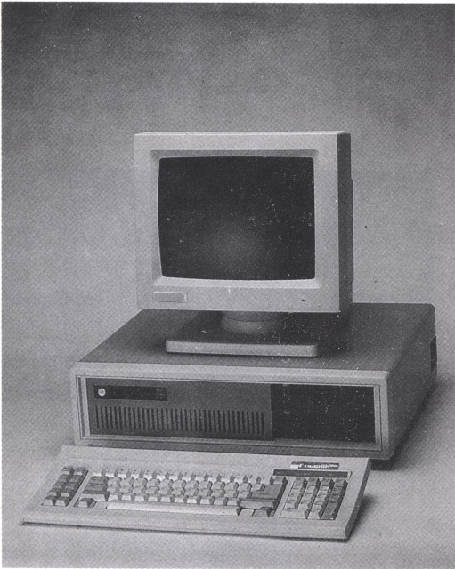
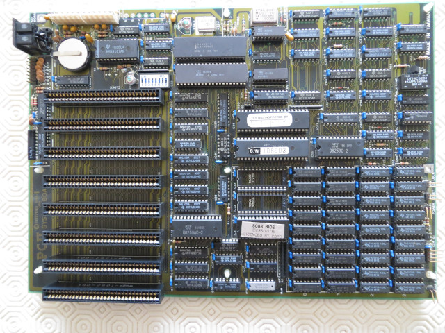

# Wugo PC II System Board Reverse Engineering Project

The aim of this project was to reverse engineer the schematics of the Wugo PC II. This is a 1986 IBM PC/XT clone made in Taiwan and looks a bit like:

The system board or motherboard looks like this:

## Features

- Intel 8088-2 running at 8 MHz (turbo) or 4.77 MHz
- Optional 8087 maths co-processor
- Up to 1MB of DRAM using standard TMS41256 DRAM (TMS4164 parts may be used to provide a minimum of 128KB)
- Memory beyond 640KB available using a custom memory page register
- Two 27256 ROM sockets for extension software such as BASIC
- 8 identical 8-bit ISA slots
- Built-in real-time clock with battery backup
- Built-in game port
- Key lock and reset switch inputs
- Power and Turbo LED outputs

## Process

The schematic for the system board contained in this repository is captured in KiCad 5.1.6. It was generated using a multimeter to systematically continuity test each of the connections on the 4-layer PCB. This took a long time! The schematic was cross-checked against the public datasheet for each of the components. Finally, the operation of key clock signals and apparently unused gates were verified by oscilloscope.

The contents of the memory decode PROM, IC100, are found in the [memory-decode-prom](memory-decode-prom/) folder along with a small python utility that will decode the contents of the memory map.

## Additional Documentation

Additional [high resolutions pictures](pictures/) are available.

I have archived various original documents on [archive.org](https://archive.org/):

- [PC II Personal computer Reference Manual](https://archive.org/details/wugo-pcii-personal-computer-reference-manual_202007)
- [PC II RS232C Serial Card](https://archive.org/details/wugo-pc-ii-rs-232-c-serial-card-user-guide)
- [PC II MS-DOS Utilities](https://archive.org/details/wugo-pc-ii-utils)
- [PC II PM-1612 Mono Video Monitor](https://archive.org/details/wugo-pc-ii-pm-1612-mono-video-monitor)

## License

 The schematics are covered by the GNU General Public License v3.
